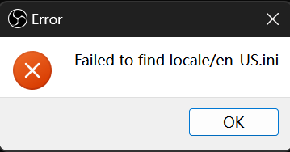

# Win11DarkTitleBar

[](https://github.com/duzhaokun123/Win11DarkTitleBar/blob/main/LICENSE)


[简体中文](README_zh_CN.md) | English

## Download

[GitHub Release](https://github.com/duzhaokun123/Win11DarkTitleBar/releases)

### Why dark title bar?

many app using Qt, gtk ... (like OBS Studio, Krita, GIMP ...) provided dark theme but has no effect on title bar

that's so **ugly**!


### How to dark title bar?

since Windows 11 Build 22000, Windows provided a new Win32 api making using dark title bar more easily

[Enable a Dark mode title bar for Win32 applications](https://learn.microsoft.com/en-us/windows/apps/desktop/modernize/apply-windows-themes#enable-a-dark-mode-title-bar-for-win32-applications)

```c++
BOOL value = TRUE;
::DwmSetWindowAttribute(hWnd, DWMWA_USE_IMMERSIVE_DARK_MODE, &value, sizeof(value));
```

### How dark title bar looks like?

just feel it


### known issues

- obs can't launch
  
  
  - replace [Locale_Remulator](https://github.com/InWILL/Locale_Remulator)'s `LRHookx64.dll` with `Hook64.dll`, and launch using lr

- no effect on some window (like `MessageBox`)

## Thanks

[Detours](https://github.com/microsoft/Detours)

[Locale_Remulator](https://github.com/InWILL/Locale_Remulator)
