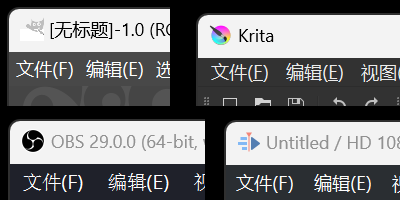
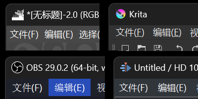
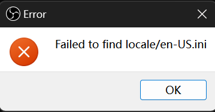

你应该使用 https://github.com/MicaForEveryone/MicaForEveryone

# Win11DarkTitleBar

[](https://github.com/duzhaokun123/Win11DarkTitleBar/blob/main/LICENSE)


简体中文 | [English](README.md)

## 下载

[GitHub Release](https://github.com/duzhaokun123/Win11DarkTitleBar/releases)

### 为什么暗色标题栏?

许多使用 Qt, gtk ... 的应用 (比如 OBS Studio, Krita, GIMP ...) 提供了暗色主题但没有暗色标题栏

丑死了! 对我的眼睛造成了极大的伤害



### 如何暗色标题栏?

从 Windows 11 Build 22000 起, Windows 提供了一个新的 Win32 api 用于更容易地实现暗色标题栏

[为 Win32 应用程序启用深色模式标题栏](https://learn.microsoft.com/zh-cn/windows/apps/desktop/modernize/apply-windows-themes#enable-a-dark-mode-title-bar-for-win32-applications)

```c++
BOOL value = TRUE;
::DwmSetWindowAttribute(hWnd, DWMWA_USE_IMMERSIVE_DARK_MODE, &value, sizeof(value));
```

### 暗色标题栏看上去怎么样?

自己看吧



## 已知问题

- obs 启动报错

  
  - 工作路径错误 应设置成 obs 安装 exe 所在路径
- 部分窗口(比如`MessageBox`)无效

## Thanks

[Detours](https://github.com/microsoft/Detours)

[Locale_Remulator](https://github.com/InWILL/Locale_Remulator)
